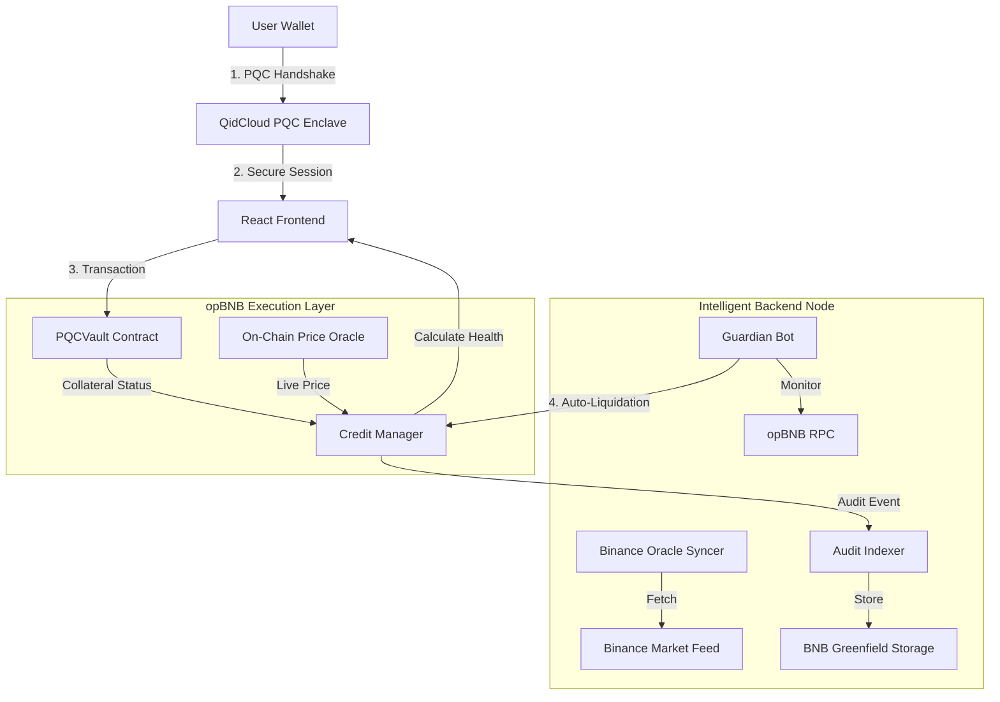
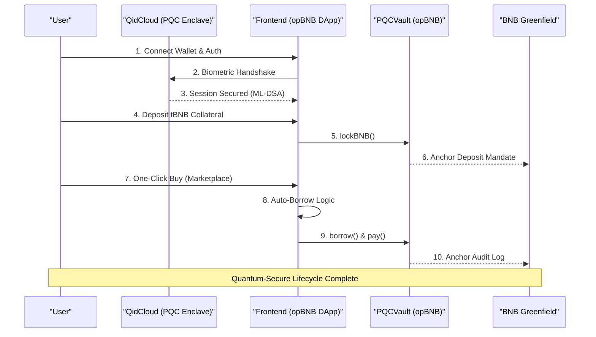

# 🛡️ BNB Collateral Credit System (PQC Edition)

> **Quantum-Secure DeFi Lending & BNPL Marketplace on opBNB**

Built for the **BNB Chain Hackathon**, this project bridges the gap between decentralized finance and real-world commerce using state-of-the-art **Post-Quantum Cryptography (PQC)** and **BNB Greenfield** for decentralized auditing.

## 🚀 Vision
As quantum computing approaches, traditional blockchain security is at risk. Our mission is to secure the future of BNB Chain commerce by integrating **ML-DSA (Module-Lattice-Based Digital Signature Algorithm)** signatures into every transaction, ensuring a future-proof, non-custodial credit ecosystem.

## ✨ Core Features
*   **🔒 PQC Security:** NIST-standard ML-DSA-65 signatures via QidCloud SDK for all authorizations.
*   **📡 Greenfield Immutable Audit:** Critical events (Liquidations, High-Value Borrows) are anchored to **BNB Greenfield** for a tamper-proof audit trail.
*   **🤖 Autonomous Guardian Bot:** A real-time Liquidation Keeper that monitors health factors and executes auto-dissolution mandates when thresholds are breached.
*   **📈 Live Oracle Heartbeat:** Real-time price syncing with **Binance API** (BNB/USDT) to ensure 100% accurate solvency monitoring.
*   **⚡ opBNB High-Speed:** Sub-cent transaction costs for credit-based shopping and high-frequency liquidation.
*   **🥐 BNPL Marketplace:** Automatic borrowing and spending in one seamless UX—buy what you need, the system borrows the rest.
*   **⚖️ Liquidation Resolution Hub:** A dedicated security view showing "Smoking Gun" evidence of system health recoveries.

## 🛠️ Tech Stack
*   **Blockchain:** Solidity (opBNB Testnet)
*   **Identity/PQC:** QidCloud (ML-DSA-65) - Quantum-safe Session Management.
*   **Decentralized Storage:** BNB Greenfield (Immutable Audit Logs & PQC Mandates).
*   **Live Data:** Binance Public API (Real-time Price Feeds).
*   **Risk Analysis:** Node.js + BscScan V2 Reputation Scoring.
*   **Frontend:** React (Vite) + Lucide + Glassmorphism / Neon UI.

### 🗺️ System Architecture

### 🛣️ User Journey

## 📖 Documentation & Guides

Explore our comprehensive technical and user guides in the [**/docs**](./docs/README.md) folder:

*   [**🏗️ Architecture Deep-Dive**](./docs/Architecture.md) - How opBNB, Greenfield, and PQC work together.
*   [**🛠️ Setup & Development**](./docs/Setup.md) - Get the system running locally in 5 minutes.
*   [**🚀 Implementation Plan**](./docs/Implementation_Plan.md) - Feature roadmap and technical milestones.
*   [**🎙️ Pitch & Demo Script**](./docs/Pitch_Script.md) - How to present the project to judges.

## 🏁 Quick Start
1.  **Backend:** `cd backend && npm install && npm run dev` (Starts the Guardian Bot + Oracle Syncer)
2.  **Frontend:** `cd frontend && npm install && npm run dev` (Starts the DApp)
3.  **Contracts:** `cd contracts && npm install && npx hardhat run scripts/deploy_full.ts`

---

**Built with ❤️ for the BNB Chain Community.** 🏆🚀🛡️
