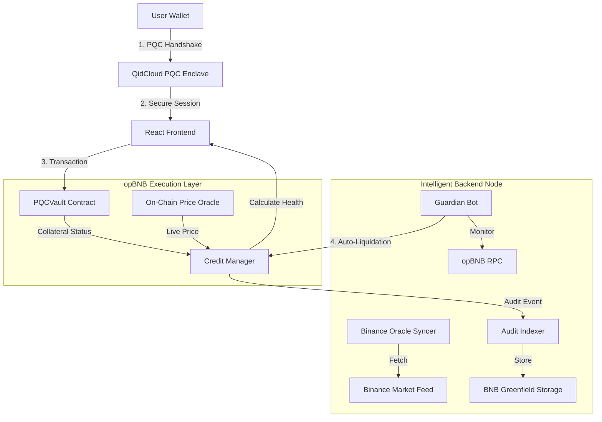
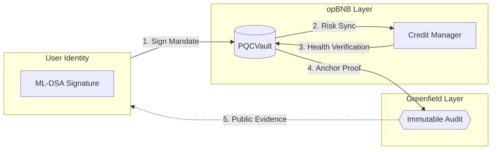

# 🏗️ System Architecture: BNB Collateral Credit System (PQC)

This document provides a deep dive into the technical architecture of the **BNB Collateral Credit System**. The project follows a "Decentralized Trinity" model, leveraging the unique strengths of **opBNB**, **BNB Greenfield**, and **QidCloud PQC**.

---

## 🛰️ High-Level Component Overview



> [!NOTE]
> **Visual Preview (If graph doesn't load):**
> ```text
> [ User Wallet ] ----> ( PQC Enclave ) ----> [ React Frontend ]
>                                                   |
>        ___________________________________________|
>       |                |                          |
> [ opBNB Vault ] <-> [ Credit Manager ] <--- [ Binance Oracle ]
>       |                         ^                 |
>       |_________________________|_________________|
>                                 |
>                         [ Greenfield Audit ]
> ```

---

## 🏛️ Layered Architecture

### 1. Execution Layer (opBNB Testnet)
The core financial logic is written in Solidity and deployed on **opBNB Testnet**. 
*   **Separation of Concerns:** Collateral management (`PQC_Vault`) is separated from the lending logic (`CreditManager`) to maximize security.
*   **Real-time Oracle:** A custom `PriceOracle` contract allows the Guardian Bot to push verified market prices on-chain, eliminating the lag issues associated with public testnet oracles.
*   **Atomic Credit:** The system uses 18-decimal precision for both tBNB and vUSD to ensure sub-cent accuracy during fractional marketplace payments.

### 2. Security & Identity Layer (QidCloud PQC)
Traditional ECDSA signatures are vulnerable to quantum Shor's algorithm. We solve this by wrapping every critical authorization in a **Post-Quantum Cryptography** layer.
*   **ML-DSA-65 signatures:** All sensitive mandates (like the "Liquidation Permission" or "High-Value Borrow") are authorized using NIST-standard module-lattice signatures.
*   **QR Bridge Handshake:** A secure mobile-to-web session that establishes a PQC-encrypted pipe for data exchange.

### 3. Auditing & Storage Layer (BNB Greenfield)
We treat **BNB Greenfield** as the protocol's "Black Box" flight recorder.
*   **Protocol-Managed Storage:** Users don't need to manage buckets. The system uses a **Tenant-Owned model** where the protocol pays for storage and anchors immutable logs on behalf of the user.
*   **E2EE Anchoring:** Audit records are formatted as JSON, signed by the PQC enclave, and uploaded with a specific Content-ID (CID). This link is displayed in the UI as the "Smoking Gun" proof of decentralized auditing.

---

## 🤖 The Guardian Bot & Oracle Engine

The backend isn't just a server; it's an **Autonomous Security Actor**. 

### **The Oracle Heartbeat**
The `Oracle Syncer` performs a high-frequency poll of the **Binance BNB/USDT ticker**. It calculates the current market volatility and pushes the price to the blockchain.
*   **Deviation Guard:** To save gas, it skips updates if the price hasn't moved by at least $0.05.
*   **Simulated Override:** Includes endpoints for the "Market Crash" demo, allowing judges to see the system react to artificial volatility.

### **The Liquidation Guardian**
The `Guardian Bot` is a 24/7 "Keeper". It continuously iterates through all active vaults on-chain.
1.  **Detection:** If a vault's `Health Factor < 1.0`, the bot alerts.
2.  **Validation:** It cross-references the user's PQC Mandate on Greenfield.
3.  **Execution:** It triggers the `liquidate` function on opBNB to close the position and recover debt, earning a 5% system fee.

---

## 🔄 Lifecycle Data Flow: "The Credit Loop"



> [!TIP]
> **Data Flow Logic:**
> ```text
> [ User Enclave ] --(1. PQC Sign)--> [ opBNB Vault ]
>                                         |
>                                (2. Verify Health)
>                                         |
>                                   [ Credit Manager ]
>                                         |
>                                 (3. Finalize Tx)
>                                         |
> [ Greenfield Storage ] <--(4. Anchor Log)--'
> ```

### Detailed Data Flow Description
1.  **Authorization**: The user generates a Post-Quantum signature in their biometric enclave.
2.  **Vault Interaction**: The `PQCVault` receives the transaction and pulls real-time BNB/USD price data from the `PriceOracle`.
3.  **Credit Check**: `CreditManager` verifies the LTV (Loan-to-Value) ratio. If the user has a high "Trust Score" (indexed from BscScan reputation), they get a 5-10% LTV bonus.
4.  **Logging**: Once the transaction is finalized on opBNB, the backend retrieves the TxHash and anchors a signed JSON record to **BNB Greenfield**.
5.  **Audit**: The user can click any "Proof" link in the frontend to fetch the raw JSON from Greenfield, serving as mathematical proof of the credit event.

---

## 📈 Tech Stack Summary
*   **Language:** TypeScript (Frontend & Backend), Solidity (Contracts).
*   **Frameworks:** React, Express, Hardhat.
*   **APIs:** Binance (Pricing), BscScan V2 (Reputation), QidCloud (PQC Identity).
*   **Hosting:** Decentralized data on BNB Greenfield.

---

**Built to secure the future of the BNB Chain Ecosystem.** 🏆🚀🛡️
