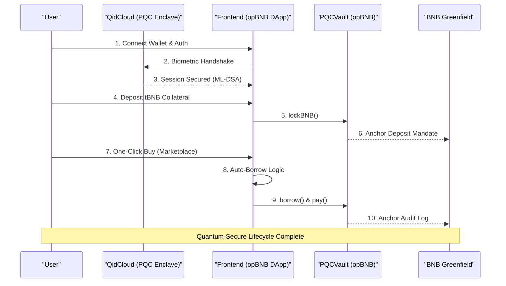

# 🏆 Hackathon Submission Details

This document consolidates all the critical links and information required for the **BNB Chain Hackathon** submission.

---

## 🔗 Quick Reference Links
*   **Tweet/X Link:** [https://x.com/ChanduChit21625/status/2027419096124621004/](https://x.com/ChanduChit21625/status/2027419096124621004/)
*   **Demo Video:** [Link to Video if available]
*   **Project Pitch Script:** [Pitch_Script.md](./Pitch_Script.md)

---

## 📜 Smart Contract URLs (opBNB Testnet)
All contracts are deployed on **opBNB Testnet (ChainID: 5611)**.

| Contract | Address | Explorer Link |
| :--- | :--- | :--- |
| **PQCVault** | `0xe1d7A8bCD7fA11F9385DC339886c1adC6e5f82DB` | [View on Scan](https://opbnb-testnet.bscscan.com/address/0xe1d7A8bCD7fA11F9385DC339886c1adC6e5f82DB) |
| **CreditManager** | `0x6016cfFB98B6413Fb5a3C545b076Fbdb931408c3` | [View on Scan](https://opbnb-testnet.bscscan.com/address/0x6016cfFB98B6413Fb5a3C545b076Fbdb931408c3) |
| **vUSD Token** | `0x949e7562eC024C562Cc124bF9CA336f97d9cAA61` | [View on Scan](https://opbnb-testnet.bscscan.com/address/0x949e7562eC024C562Cc124bF9CA336f97d9cAA61) |
| **PriceOracle** | `0xeaEa4A52C1C2Ce674B80b79d7E54Bb3FD8A8f2f9` | [View on Scan](https://opbnb-testnet.bscscan.com/address/0xeaEa4A52C1C2Ce674B80b79d7E54Bb3FD8A8f2f9) |

---

## 🗺️ User Journey Diagram

> [!TIP]
> **User Journey Flow:**
> 1. **Auth:** User --(Biometrics)--> QidCloud (PQC Session)
> 2. **Stake:** User --(tBNB)--> opBNB Vault (Collateral Locked)
> 3. **Verify:** Vault --(Signed JSON)--> Greenfield (Audit Trail)
> 4. **Spend:** User --(One-Click)--> Marketplace (Auto-Borrow Logic)
> 5. **Sync:** Credit Manager --(vUSD)--> Seller (Atomic Settlement)

---

## 📅 6-Month Roadmap: Post-Hackathon Planning
If selected/funded, here is our dedicated expansion plan:

1.  **Month 1-2: Mainnet Hardening**
    *   Transition from Testnet Oracles to a decentralized Chainlink/Pyth integration.
    *   Third-party security audit of the `PQCVault` and `CreditManager` logic.
2.  **Month 3-4: Multi-Collateral Expansion**
    *   Enable staking of liquid-staked BNB (lsBNB) as collateral.
    *   Introduce "Institutional Enclaves" for corporate credit lines.
3.  **Month 5-6: Advanced Greenfield Integration**
    *   Implement "Privacy Streams" on Greenfield where audit logs are encrypted and only viewable by authorized reg-tech entities.
    *   Build a decentralized Keeper Network to replace the singular Guardian Bot.

---

## 📝 Notes to Organizers
*   **QidCloud PQC Integration:** We highly recommend organizers check out the **QidCloud Mobile Authentication** flow used in this project. It solves the "Key Management" problem by using hardware-backed biometrics to generate ML-DSA signatures, effectively making the wallet quantum-resistant without a seed phrase change.
*   **Greenfield as a Black Box:** Notice how the `Audit Log` page links every record to Greenfield. We are using Greenfield not just for "storage," but as a verifiable ledger of security mandates.

---

## ⚙️ Deployment Summary (Server Logs)
To verify the system locally or on a private node:
1.  **Backend (Risk Engine):** Run `npm run dev` in `/backend`. It syncs Binance prices and runs the Guardian Bot.
2.  **Frontend:** Run `npm run dev` in `/frontend`.
3.  **Simulation:** Use the "Guardian Control Panel" in the DApp to trigger a market crash and observe the Bot verifying mandates on Greenfield before dissolving debt.

---
**Built for the future of the BNB Chain.** 🏆🚀🛡️
